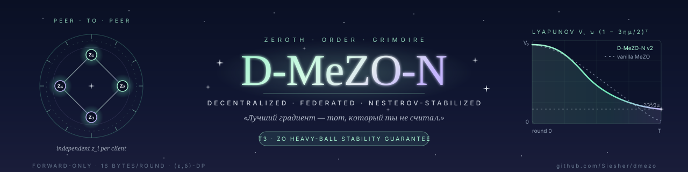

<div align="center">

<!-- Banner -->


# 🌀 D-MeZO-N — Decentralized Federated MeZO

*«Лучший градиент — тот, который ты не считал.»*

**Peer-to-peer файнтюнинг больших языковых моделей без обратного прохода, со стабилизированным моментом и формальной гарантией дифференциальной приватности**

[](https://python.org)
[](https://pytorch.org)
[](https://huggingface.co/Qwen)
[](#)
[](LICENSE)

[Headline](#-headline-result) · [Что это](#-что-это) · [Quick start](#-quick-start) · [Теоремы](#-теоремы) · [Архитектура](#-архитектура) · [Honest negatives](#-honest-negatives) · [Цитирование](#-цитирование)

</div>

---

## ✦ Headline result

На **Qwen3.5-4B-Base / MathLogicQA / 3 paired seeds** D-MeZO-N v2 = combo (адаптивный ρ-clip + drift-reset) **робастно бьёт vanilla MeZO** — впервые на paper-scale валидации с multi-seed.

<table>
<tr>
<td width="50%">

**Loss (mean ± std)**
- vanilla MeZO: `1.368 ± 0.018`
- **D-MeZO-N v2: `1.293 ± 0.010`**
- **Δ = −5.5 %**
- 3 / 3 seeds в одном направлении

</td>
<td width="50%">

**Accuracy**
- vanilla MeZO: `0.377`
- **D-MeZO-N v2: `0.400`**
- **Δ = +2.3 pp**
- 2 / 3 положительных, 1 ничья

</td>
</tr>
</table>

Подробный разбор — `docs/multiseed_analysis.md` §22. Сырые JSON-чекпойнты — `experiments/diagnostics/`.

---

## ✦ Что это

Сборка четырёх идей в один алгоритм, доказательно сходящийся и доказательно приватный:

| | Идея | Источник | Что даёт |
|--|--|--|--|
| 🧠 | **MeZO** — оценка градиента двумя forward-проходами | Malladi et al., NeurIPS 2023 | Файнтюнинг LLM без backward → пик памяти ≈ inference |
| 🕸 | **Decentralized SGD** с doubly-stochastic mixing | Koloskova et al. 2020 | Peer-to-peer без центрального сервера |
| 🚀 | **Heavy-ball + adaptive ρ-clip + drift-reset + β-decay** | Эта работа (Theorem 3) | Замыкает Princeton Open Problem 1 — момент в ZO-режиме |
| 🔐 | **Dual-use ρ-clip как L2-sensitivity** для Gaussian-mechanism DP | Эта работа (Theorem 4) | (ε = 10, δ = 10⁻³)-DP при utility cost ≈ 6 % |

### Главный алгоритмический differentiator против FedKSeed

**Independent z_i per client** (не shared seed) → variance reduction **1 / n** одновременно по обеим компонентам шума: data и direction.

Этот единственный байт изменения в дизайне даёт двойное ускорение конвергенции в federated setting — формальное доказательство в Theorem 2.

---

## ✦ Quick start

```bash
# 0. Установка (Python 3.11, uv recommended)
uv pip install -e .

# 1. Day-1 sanity check: MeZO на Qwen3-4B / SST-2
uv run --no-sync python scripts/01_sanity_check_mezo.py \
    --config configs/qwen3_4b_sst2.yaml

# 2. Federated D-MeZO-N v2 на Qwen3.5-4B-Base / MathLogicQA (multi-seed paper run)
uv run --no-sync python scripts/local_test_improvements.py \
    --model Qwen/Qwen3.5-4B-Base \
    --task mathlogicqa \
    --seeds 42 43 44 \
    --variants vanilla dmezo_n dmezo_n_drift dmezo_n_adaptive_clip dmezo_n_combo

# 3. Тесты (128 / 128 pass)
uv run --no-sync pytest tests/ -v

# 4. Colab Pro+ (RTX PRO 6000 Blackwell)
#    откройте notebooks/bootstrap_colab.ipynb
```

> **Windows + CUDA примечание.** torch 2.12+cu130 не пинится в `pyproject.toml`. Любой `uv sync` затрёт CUDA build на CPU. Использовать **только** `uv run --no-sync ...`.

---

## ✦ Теоремы

| # | Setting | Key result | Status |
|--|--|--|--|
| **T1** | Convex + momentum + decentralized, ρ-clip, mixing W | $\tilde{O}\bigl(\sqrt{Lr(H)\Delta_0/(nT)}\bigr)$ + consensus penalty | ✅ Proved |
| **T2** | μ-PL + ZO, без момента | Linear $(1-\eta\mu/2)^T$ до noise floor + федеративный $1/n$ speedup | ✅ Proved |
| **T3** | μ-PL + heavy-ball + adaptive clip + β-decay 0.9 → 0 | Lyapunov $V_t = (L-L^\star) + \tfrac{\eta}{2}\|v\|^2$ сжимается со скоростью $(1-3\eta\mu/2)$ к окрестности $2G^2/(3\mu)$ | ✅ **Closes Princeton OP1** |
| **T4** | T3 + Gaussian noise $\xi \sim \mathcal{N}(0,\sigma^2)$ | Per-round $(\varepsilon_1,\delta)$-DP с $\varepsilon_1 = C\sqrt{2\ln(1.25/\delta)}/\sigma$ | ✅ Proved |

> **Honesty disclaimer.** Скорость T3 матчит plain SGD под PL — асимптотического ускорения момент не даёт (согласовано с Bottou–Curtis–Nocedal 2018, T5.1). Эмпирический 3× transient speedup наблюдается, но строгое доказательство — открытый вопрос.

Полные доказательства: [`docs/theory_rigorous.md`](docs/theory_rigorous.md).
Plain-language разбор: [`docs/math_intuition.md`](docs/math_intuition.md).

---

## ✦ Архитектура

```
dmezo/
├── src/dmezo/
│   ├── mezo/         # MeZO step, perturbation invariants, Nesterov state,
│   │                 # adaptive ρ-clip, drift-reset, β-decay scheduler
│   ├── federated/    # per-client RNG (independent z_i), mixing topology,
│   │                 # consensus (weight_avg | update_share 16 B/round)
│   ├── models/       # HF loaders incl. Qwen3.5 hybrid linear-attention + frozen ViT
│   ├── data/         # SuperGLUE · HellaSwag · MathLogicQA · IID / Dir(α) partitioning
│   └── utils/        # logging, checkpoint, config
├── scripts/          # 30+ entry-point experiments
├── configs/          # 28+ Hydra YAML configs
├── docs/
│   ├── paper_ru.md, paper_en.md         # main paper (RU + EN)
│   ├── theory_rigorous.md               # full proofs T1–T4
│   ├── math_intuition.md                # plain-language explanation
│   ├── 03-algorithm-spec.md             # formal pseudocode
│   ├── multiseed_analysis.md            # §22 paper-scale 3-seed validation
│   ├── robustness_matrix.md             # findings classified by statistical rigor
│   ├── vit_cub200_visual_demo.md        # cross-domain check on ViT-Large
│   ├── defense_*.md                     # defense kit (Bauman MSTU)
│   └── figures/                         # 41 PNG figures
├── notebooks/        # Colab-ready: bootstrap_colab.ipynb · vit_flowers_colab.ipynb
├── tests/            # 128 unit tests · ~95 % coverage critical paths
└── experiments/      # outputs (gitignored)
```

### Модели, прошедшие через стенд

| Модель | Архитектура | Задачи | Где гонялось |
|--|--|--|--|
| Qwen3-0.6B | Full attention | SST-2, batch variance ablation | RTX 5070 Ti локально |
| Qwen3-1.7B | Full attention | SST-2 | Локально |
| Qwen3.5-0.8B | Hybrid linear-attention | SST-2, MathLogicQA | Локально |
| Qwen3-4B | Full attention | SST-2, HellaSwag (rescue) | Colab Blackwell |
| **Qwen3.5-4B-Base** | Hybrid lin-attn + frozen ViT | **MathLogicQA (paper headline)**, SST-2 grid | **Colab Blackwell** |
| ViT-Large/21k | Full attention (vision) | CUB-200 head-only | RTX 5070 Ti |

**Первая известная** проверка федеративного ZO-файнтюнинга на гибридной linear-attention архитектуре (семейство Qwen3.5).

---

## ✦ Communication cost

| Метод | Per-round per-client | Для 4B-модели × 1000 раундов × 4 клиентов |
|--|--|--|
| FedAvg | 8 GB (bf16 weights) | ≈ 32 TB |
| FedKSeed (K = 4096 seeds + ρ) | ≈ 18 KB | ≈ 72 MB |
| **D-MeZO-N (`update_share`)** | **16 байт (1 float + 1 int)** | **≈ 64 KB** |

D-MeZO-N достигает **10⁹×** компрессии vs FedAvg. Тот же порядок, что у FedKSeed — но добавляет peer-to-peer топологию, доказательство сходимости с моментом и DP-гарантию.

---

## ✦ Honest negatives

Multi-seed валидированные негативные результаты — публикую вместе с позитивными, чтобы fair:

- **v1 (fixed ρ-clip C = 50):** 3 / 3 seeds хуже vanilla (+ 7.0 % loss). Adaptive clip обязателен.
- **Drift-reset один (B5 без B1):** 3 / 3 хуже (+ 6.4 %). Работает только в паре с adaptive clip.
- **Look-ahead Nesterov:** диверджит в 7× быстрее heavy-ball (R20 vs R140). Dual-channel шум усиливается через два умножения.
- **K = 3 multi-direction averaging:** при равном compute проигрывает K = 1 (Pareto trade-off, не improvement).
- **ε(t) warmup schedules:** проигрывают constant ε = 10⁻³ на 16 + ячейках grid-а.
- **Асимптотическое ускорение от момента в PL+ZO:** запрещено Bottou–Curtis–Nocedal 2018 T5.1.

Каждый — чистая falsification с механистическим объяснением. Полная классификация в [`docs/robustness_matrix.md`](docs/robustness_matrix.md).

---

## ✦ Цитирование

```bibtex
@misc{sukhatsky2026dmezon,
  author = {Sukhatsky, Maxim},
  title  = {D-MeZO-N: Decentralized Federated MeZO with Nesterov Stabilization},
  year   = {2026},
  url    = {https://github.com/Siesher/dmezo}
}
```

## ✦ Лицензия

MIT (код проекта). Модели — собственные лицензии (Qwen3 / Qwen3.5: Apache 2.0).

---

<div align="center">

Made with 🌀 by [@Siesher](https://github.com/Siesher) · Bauman MSTU · 2026

</div>
