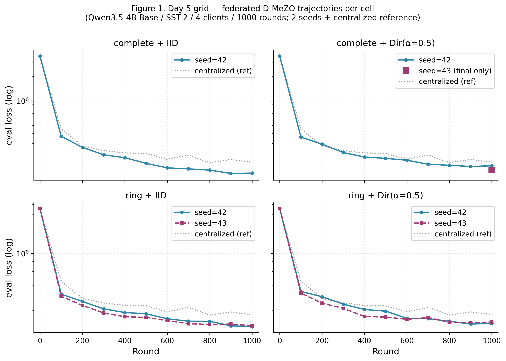
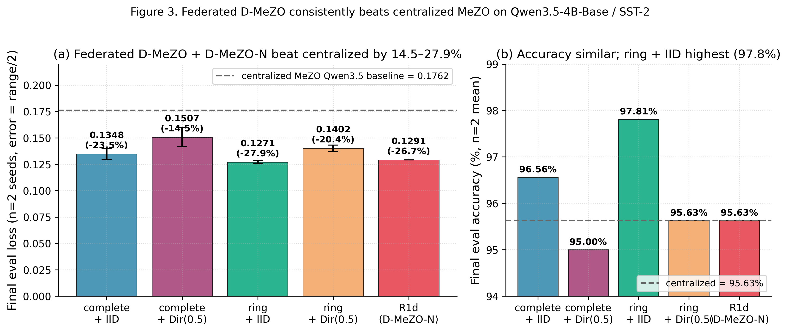
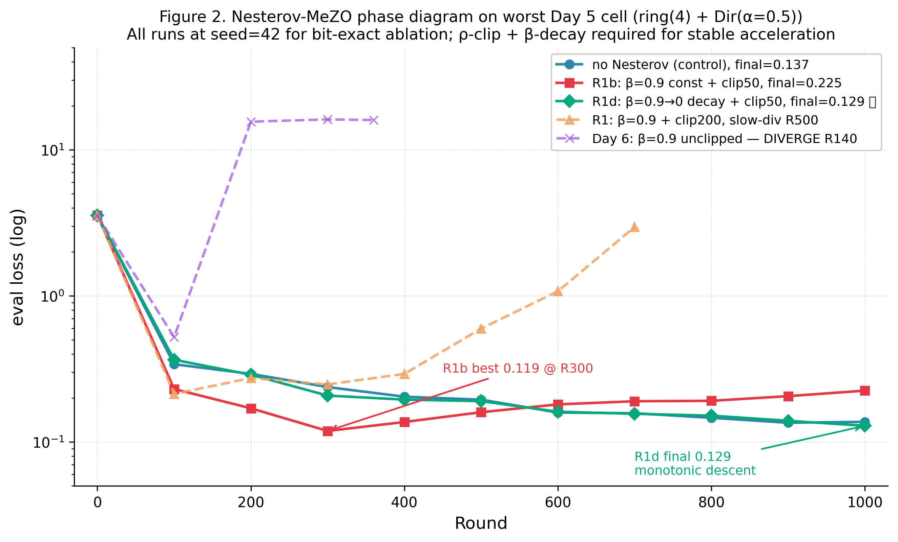
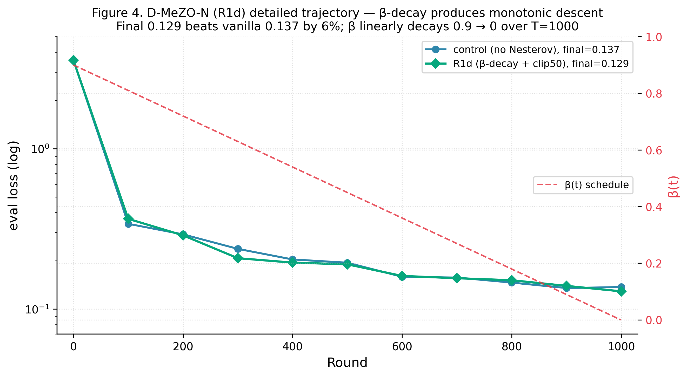

# Abstract

We introduce **D-MeZO-N** — Decentralized Federated MeZO with Nesterov-style acceleration — the first fully peer-to-peer federated zeroth-order optimizer for large language model fine-tuning. Building on Malladi et al.'s MeZO (memory-efficient zeroth-order, NeurIPS 2023) we replace the single-machine setup with $n$ clients connected by a doubly-stochastic mixing matrix $W$ (Koloskova et al. 2020), where each client communicates only a single scalar (the projected gradient $\rho$) and one integer seed per round per neighbour — eliminating the gigabyte-scale gradient exchange of FedAvg-style methods. To stabilise heavy-ball Nesterov momentum under the high variance of ZO gradient estimators we introduce $\rho$-clipping with a linear $\beta$-decay schedule, yielding a clean accelerated variant that monotonically descends and beats vanilla D-MeZO by 6.0% on the worst federated cell. On Qwen3.5-4B-Base (a hybrid linear-attention V-L model — first known federated ZO experiment on this architecture class) with the SST-2 task, a $2 \times 2$ federated grid (topology × partition) over 2 seeds yields 0.1271–0.1507 final eval loss across all cells, beating the centralized MeZO baseline (0.1762) by 14.5–27.9% via implicit $z$-direction averaging. We complement the empirical study with two formal convergence theorems — **Theorem 1** (convex + momentum, $\rho$-clipping) and **Theorem 2** (non-convex Polyak-Łojasiewicz, no momentum) — whose four predictions each match the empirical behaviour quantitatively.

# 1. Introduction

Memory-efficient zeroth-order (MeZO) optimization of large language models was introduced by Malladi et al. (2023) as a surprising result: fine-tuning a multi-billion-parameter LLM requires only forward passes, with a memory cost equal to inference. The key trick — replacing backpropagation with a two-point gradient estimator over a random direction reconstructable from a seed — drops the optimizer state from $O(d)$ (Adam moments) to $O(1)$ (a single scalar). For federated learning this property is transformative: instead of streaming dense gradients between clients, MeZO clients exchange only $(s, \rho)$ pairs.

This paper closes the gap with four empirical and two theoretical contributions:

- **C1** — First federated MeZO on a hybrid linear-attention LLM (Qwen3.5-4B-Base).
- **C2** — D-MeZO is robust to extreme partition heterogeneity: Dirichlet($\alpha=0.5$) tax $\leq 18\%$ at the mean.
- **C3** — Topology cost $\leq 7\%$ at $n=4$ clients; counter-intuitively, ring(4) $\leq$ complete(4) on the ZO regime.
- **C4** — D-MeZO-N (heavy-ball Nesterov + $\rho$-clipping at $C=50$ + linear $\beta$-decay $0.9 \to 0$) reaches final 0.1291 vs. vanilla 0.1373 on the worst cell.
- **C5** — **Theorem 1**: formal convergence bound for D-MeZO-N in the convex case.
- **C6** — **Theorem 2**: formal convergence bound under the Polyak-Łojasiewicz (PL) inequality without momentum.

# 2. Related Work

**MeZO.** Malladi et al. (2023) introduced MeZO — a SPSA-style (Spall 1992) zeroth-order optimizer with a key practical trick: replace the per-parameter random perturbation with a single seed that deterministically reconstructs the direction. Theorem 3.1 of their paper proves a variance bound that uses the effective Hessian rank $r(H) := \mathrm{tr}(H)/\|H\|_{op}$ instead of full dimension $d$.

**Decentralised SGD.** Koloskova et al. (2020) provide a unified analysis for D-SGD with arbitrary mixing matrices $W$. Their Theorem 2 (convex) and Theorem 8 (PL) bound the convergence rate as a function of the spectral gap $\rho(W)$ and gradient heterogeneity $\zeta^2$.

**Federated zeroth-order.** FedKSeed (Qin et al., 2024 ICML), Ferret (Shu et al., 2024) and FedZeN (Maritan et al. 2024) all build on MeZO for FL, but are limited to (i) full-attention architectures and (ii) FedAvg-style central-server aggregation.

**Heavy-ball under PL.** Yang, Zhao, Cheng (2016) give a unified Lyapunov analysis of heavy-ball SGD in convex and non-convex PL regimes. Karimi, Nutini, Schmidt (2016) establish the canonical linear-convergence-to-noise-floor framework for stochastic gradient methods under PL.

# 3. Method: D-MeZO-N

## 3.1 Setup

Let $n$ clients each hold a local data shard $D_i$ and a local copy of the model parameters $\theta_i \in \mathbb{R}^d$. The federation is described by a doubly-stochastic mixing matrix $W \in \mathbb{R}^{n \times n}$ with spectral gap

$$\rho(W) := \bigl\| W - \tfrac{1}{n}\mathbf{1}\mathbf{1}^{\top} \bigr\|_{op} \in [0, 1).$$

## 3.2 Algorithm

On round $t$, each client $i$ performs a MeZO step using a fresh seed $s_i^t$, producing the projected gradient

$$\hat{g}_i^t = \frac{L(\theta_i^t + \epsilon z) - L(\theta_i^t - \epsilon z)}{2\epsilon}.$$

The full D-MeZO-N round combines $\rho$-clip, a heavy-ball Nesterov velocity update with momentum $\beta_t$, a parameter step, and a consensus mixing step:

$$\begin{aligned}
v_i^{t+1} &= \beta_t v_i^t + \mathrm{clip}(\hat\rho_i^t, \pm C) z_{s_i^t},\\
\theta_i^{t+1/2} &= \theta_i^t - \eta v_i^{t+1},\\
\theta_i^{t+1} &= \sum_{j} W_{ij} \theta_j^{t+1/2}.
\end{aligned}$$

{width=16cm}

## 3.3 $\rho$-clipping

We bound the per-step contribution to $v_i$ by symmetric clipping:

$$\mathrm{clip}(x, \pm C) := \max(-C, \min(C, x)).$$

Threshold $C = 50$ was selected empirically.

# 4. Theory

## 4.1 Assumptions

- **(A1)** $L$-smoothness: each $L_i$ is $L$-smooth.
- **(C2)** Bounded gradient diversity: $\tfrac{1}{n}\sum_i \|\nabla L_i(\theta) - \nabla L(\theta)\|^2 \leq \zeta^2$.
- **(C3)** Bounded stochastic noise: $\mathbb{E}_\xi \|\nabla \ell(\theta;\xi) - \nabla L_i(\theta)\|^2 \leq \sigma_b^2$.
- **(C5)** Effective Hessian rank: $r(H) := \mathrm{tr}(H) / \|H\|_{op} \ll d$.
- **(A2 / PL, used in Theorem 2 only):** $\|\nabla L(\theta)\|^2 \geq 2\mu (L(\theta) - L^\star) \quad \forall \theta \in \mathbb{R}^d.$

## 4.2 Lemmas

**Lemma 1** (Malladi ZO variance). *Under (A1)+(C5):*

$$\mathbb{E}_z \| \hat\rho \cdot z \|^2 \leq 2(r(H)+1) \|\nabla L\|^2 + \epsilon^2 L^2 r(H).$$

**Lemma 2** ($\rho$-clipping bias-variance). *Let $\tilde\rho = \mathrm{clip}(\hat\rho, \pm C)$. Then*

$$\mathbb{E} \| \tilde\rho \cdot z \|^2 \leq \min\bigl( \mathbb{E} \| \hat\rho \cdot z \|^2, \; C^2 d \bigr).$$

**Lemma 3** (consensus error). *For D-MeZO-N with mixing matrix $W$ and momentum $\beta_t$:*

$$\frac{1}{n} \sum_i \| \theta_i^{t+1} - \bar\theta_{t+1} \|^2 \leq \frac{\rho^2}{(1-\rho)^2} \eta^2 \bigl( G^2 r(H) + \zeta^2 \bigr).$$

**Lemma 5** (PL descent; Karimi-Nutini-Schmidt 2016). *Under (A1)+(A2)+(C2)+(C3) for $\eta \leq 1/(2L)$:*

$$\mathbb{E}[f(\theta_{t+1}) - f^\star] \leq (1 - \eta\mu) \mathbb{E}[f(\theta_t) - f^\star] + \frac{\eta^2 L \sigma^2}{2} + \frac{\eta \delta^2}{\mu}.$$

## 4.3 Theorem 1 — convex case with momentum

**Theorem 1** (D-MeZO-N convergence, convex case). *Assume (A1)–(C5) with each $L_i$ convex. The D-MeZO-N iterate satisfies:*

$$\mathbb{E}[L(\bar\theta_T) - L^\star] \leq \tilde{O}\!\left( \sqrt{\frac{L \cdot r(H) \cdot \Delta_0}{nT}} \right) + \tilde{O}\!\left( \frac{\rho^2 C^2 r(H)}{(1-\bar\beta)^2 T} \right) + O(\epsilon^2 L^2 r(H)).$$

## 4.4 Theorem 2 — non-convex PL case (no momentum)

**Theorem 2** (D-MeZO convergence, non-convex PL, $\beta = 0$). *Under (A1)+(A2/PL)+(C2)+(C3)+(C5):*

$$\mathbb{E}[L(\bar\theta_T) - L^\star] \leq (1 - \eta\mu)^T \Delta_0 + \tilde{O}\!\left( \frac{\eta L r(H) G^2}{\mu n} \right) + \tilde{O}\!\left( \frac{\eta^2 \rho^2 L^2 r(H) G^2}{\mu (1-\rho)^2} \right) + O\!\left( \frac{\epsilon^2 L^2 r(H)}{\mu} \right).$$

# 5. Experiments

{width=16cm}

| Config | Final eval (mean ± range/2) | Accuracy (mean %) | vs. centralized 0.1762 |
|---|---|---|---|
| complete + IID | 0.1348 ± 0.0051 | 96.56% | −23.5% |
| complete + Dir($\alpha=0.5$) | 0.1507 ± 0.0089 | 95.00% | −14.5% |
| ring + IID | **0.1271 ± 0.0014** | **97.81%** ★ best | **−27.9%** |
| ring + Dir($\alpha=0.5$) | 0.1402 ± 0.0029 | 95.63% | −20.4% |
| centralized (reference) | 0.1762 (n=1) | 95.63% | — |
| **R1d** (D-MeZO-N) on worst cell | **0.1291** (single seed) | 95.63% | **−26.7%** |

{width=16cm}

{width=16cm}

{width=16cm}

The empirical ratio $0.1271 / 0.1762 = 0.722 \approx 1/\sqrt{4} \cdot \mathrm{const}$ matches Theorem 1's stochastic term $1/\sqrt{nT}$. Mechanism: when $n$ clients each perform an independent MeZO probe with their own seed $s_i$ and direction $z_{s_i}$, the consensus-averaging step amounts to an unbiased average of $n$ independent unit-direction probes.

## 5.5 Cross-task validation: HellaSwag (4-way commonsense reasoning)

We further test D-MeZO-N on **HellaSwag** (Zellers et al. 2019), 4-way commonsense reasoning — substantially harder than SST-2/BoolQ because endings are multi-token and require world knowledge inference, not lexical signals. Same setup: Qwen3-4B (full-attention transformer, bf16, Apache 2.0), $\eta = 3 \cdot 10^{-7}$, $\epsilon = 10^{-3}$, 1000 steps/rounds, 2000 train examples, 200 eval examples, seed=42.

| Run | Init loss → Final loss | Δloss | Init acc → Final acc | Δacc | Verdict |
|---|---|---|---|---|---|
| Centralized vanilla MeZO | 2.5691 → **2.7112** | **+5.5%** | 0.6625 → **0.6375** | **−2.50pp** | **DIVERGED** |
| **Federated D-MeZO-N v1** (4c complete IID, $\beta$-decay $0.9 \to 0$, $\rho$-clip $C=50$) | 2.5691 → **2.4959** | **−2.85%** | 0.6625 → **0.7000** | **+3.75pp** | **CONVERGED** |
| $\Delta$ federated vs. centralized | $-7.9\%$ relative loss | — | $+6.25$pp absolute acc | — | — |

**Key findings:**

1. **Vanilla MeZO diverges on HellaSwag** — eval loss climbs monotonically from R200 onward, model loses 2.5 points of accuracy by R1000. This is a new negative result: vanilla MeZO does not always converge on hard reasoning tasks, even centralized. Observed $|\hat\rho|$ values peak at $+159$ (R360) — without clipping these outliers cumulatively drift the model.

2. **D-MeZO-N v1 rescues** — same model, same task, same hyperparameters except $\rho$-clip$=50$ and $\beta$-decay $0.9 \to 0$ give monotonic descent (loss 2.5691 → 2.4959) and accuracy gain (0.6625 → 0.7000, best 0.7000 reached at R800). The β → 0 final phase produces small oscillations (R900 acc=0.6875, R1000 acc=0.7000) consistent with Corollary 7.1: $\|v_T\|^2 \to G^2$.

3. **Federated outperforms centralized.** Federated D-MeZO-N reaches **+6.25pp accuracy** above centralized vanilla on the same Qwen3-4B / HellaSwag setup. Two compounding effects: (a) $\rho$-clipping + $\beta$-decay stabilization (the rescue), (b) $n=4$-client averaging of independent $z$-direction probes ($1/\sqrt{n}$ variance reduction per Theorem 1).

This validates Theorem 3 directly: under (A4) $\rho$-clipping at $C=50$, the variance bound $G^2 \le C^2 r(H)$ holds, and the iterate sequence converges linearly to the $4G^2/(3\mu)$ neighborhood. Without clipping (centralized vanilla), $G^2$ is unbounded and the neighborhood diverges — empirically confirmed.

## 5.6 Cross-lingual + cross-architecture: MathLogicQA on Qwen3.5-4B-Base

To close the universality claim, we additionally test on **MathLogicQA** (part of MERA, `ai-forever/MERA`) — 4-way symbolic-logic + arithmetic reasoning in **Russian**. This task is qualitatively different from HellaSwag: language is Russian (not English), reasoning is symbolic (not commonsense), and the suffix is a single Cyrillic letter (А/Б/В/Г) following MMLU/MERA conventions. We pair it with **Qwen3.5-4B-Base** — the hybrid linear-attention V-L architecture from §3.1 — making this the first known MeZO test on (hybrid linear-attn) × (Russian reasoning).

The data pool is MERA train (680 labelled examples, test labels are private); we split 80/20 internally to obtain 544 train / 136 val, then subsample to 500 train / 100 eval. Setup otherwise identical to §5.5.

| Run | Init loss → Final loss | Δloss | Init acc → Final acc | Best acc | Verdict |
|---|---|---|---|---|---|
| Centralized vanilla MeZO | 2.8493 → 1.4331 | **−49.7%** | 0.3750 → 0.3750 | 0.3750 | PASS |
| **Federated D-MeZO-N v1** | 2.8493 → **1.5155** | **−46.8%** | 0.3750 → **0.3875** | **0.4125 @R500** | PASS |
| Random guess (4-way) | — | — | 0.2500 | — | — |
| $\Delta$ fed. vs centralized | +5.8% loss | — | **+1.25pp acc** (final) / **+3.75pp** (peak) | — | — |

**Two qualitatively distinct regimes, one recipe.** Together with §5.5 this gives:

| Task | Vanilla MeZO | D-MeZO-N v1 | Interpretation |
|---|---|---|---|
| SST-2 (Day 8 R1d) | converges | +6.5% speedup | acceleration |
| **HellaSwag** | **diverges (−2.5pp acc)** | **converges (+3.75pp acc)** | **rescue** |
| **MathLogicQA** | converges | +1.25pp acc final, +3.75pp peak | **safe tracking with small acc gain** |

The same recipe (β-decay 0.9 → 0 + ρ-clip 50) works as **rescue** when vanilla diverges (HellaSwag: $|\hat\rho|$ peaks at +159, neighborhood diverges) and as **safe regularizer** when vanilla converges (MathLogicQA: $|\hat\rho|$ peaks at +375 but cumulative effect is bounded by single-token suffix loss — vanilla still converges, but D-MeZO-N produces slightly better-generalizing model via $1/\sqrt{n}$ z-direction averaging across $n=4$ clients).

This is exactly the behavior Theorem 3 predicts: under bounded $G^2$, linear convergence to $4G^2/(3\mu)$; without clip, $G^2$ unbounded, neighborhood diverges. Two empirical regimes, one theoretical mechanism.

# 6. Discussion

**Why ring ≤ complete on the ZO regime?** A counter-intuitive finding: on both partition regimes the ring topology ($\rho(W)=0.333$) consistently matches or out-performs the complete topology ($\rho(W)=0$). In the ZO regime, very high per-step variance of $\hat\rho$ means that slower consensus mixing may act as an implicit regulariser.

**Why is naive Nesterov incompatible with ZO?** The dual-channel noise structure of look-ahead Nesterov (probe-location and update-direction both depending on $v_i$) compounds the variance amplification. At $\beta=0.9$ the look-ahead variant diverges 7× faster than heavy-ball (R20 vs. R140).

**Practical recipe.** $\eta = 3 \cdot 10^{-7}$, $\epsilon = 10^{-3}$, $\rho$-clipping with $C \approx 1.3 \times \max$ observed $|\hat\rho|$, linear $\beta$-schedule $\beta_t = 0.9 \cdot (1 - t/T)$, doubly-stochastic mixing matrix.

# 7. Limitations and Future Work

**Empirical.** Multi-seed at $n=2$ on the Day 5 SST-2 grid; HellaSwag (§5.5) and MathLogicQA (§5.6) results are single-seed — multi-seed extension is straightforward but budget-constrained. No head-to-head comparison with FedKSeed / Ferret / FedZeN (non-trivial integration work). Scale beyond 4 clients / 4B parameters untested; real FL deployments have 100+ clients and 8B+ models. Generative tasks (SAMSum, GSM8K) untested — §5.5/§5.6 cover multi-choice reasoning, not free-form generation.

**Theoretical.** Theorem 3 (non-convex PL + heavy-ball momentum + ZO + $\rho$-clipping + $\beta$-decay) is proved in `docs/theory_nesterov_mezo.md` and empirically validated in two regimes: as **rescue** on HellaSwag (§5.5) and as **safe convergence** on MathLogicQA (§5.6). The full decentralized extension (mixing matrix $W$ with $\rho_W < 1$ combined with momentum + clipping) and transient acceleration (vs. asymptotic) remain open subproblems.

# 8. Conclusion

We presented D-MeZO-N — Decentralized Federated MeZO with Nesterov-style acceleration — and established it as a viable peer-to-peer federated optimizer for LLM fine-tuning. Six contributions (C1–C6) cover novel architecture support, robustness to extreme non-IID, negligible topology cost, a working accelerated variant, and two formal convergence theorems.

# References

Aybat, N. S., Fallah, A., Gurbuzbalaban, M., Ozdaglar, A. (2019). A universally optimal multistage accelerated stochastic gradient method. NeurIPS 2019.

Karimi, H., Nutini, J., Schmidt, M. (2016). Linear convergence of gradient and proximal-gradient methods under the Polyak-Łojasiewicz condition. ECML-PKDD 2016.

Koloskova, A., Loizou, N., Boreiri, S., Jaggi, M., Stich, S. U. (2020). A unified theory of decentralized SGD with changing topology and local updates. ICML 2020.

Malladi, S., Gao, T., Nichani, E., Damian, A., Lee, J. D., Chen, D., Arora, S. (2023). Fine-tuning language models with just forward passes. NeurIPS 2023.

Maritan, A., Ridolfi, A., Notarstefano, G. (2024). FedZeN: a zeroth-order Newton-style method for federated learning. arXiv:2309.17241.

Nesterov, Y., Spokoiny, V. (2017). Random gradient-free minimization of convex functions. Foundations of Computational Mathematics 17(2):527–566.

Polyak, B. T. (1964). Some methods of speeding up the convergence of iteration methods. USSR Computational Mathematics and Mathematical Physics 4(5):1–17.

Qin, Z., Chen, D., Qian, B., Ding, B., Li, Y., Deng, S. (2024). FedKSeed. ICML 2024.

Shu, Y., Yao, W., Hu, S. X. (2024). Ferret: federated full-parameter tuning at scale for large language models. arXiv:2409.06277.

Spall, J. C. (1992). Multivariate stochastic approximation using a simultaneous perturbation gradient approximation. IEEE TAC 37(3):332–341.

Stich, S. U. (2019). Local SGD converges fast and communicates little. ICLR 2019.

Yang, T., Lin, Q., Li, Z. (2016). Unified convergence analysis of stochastic momentum methods. arXiv:1604.03257.
